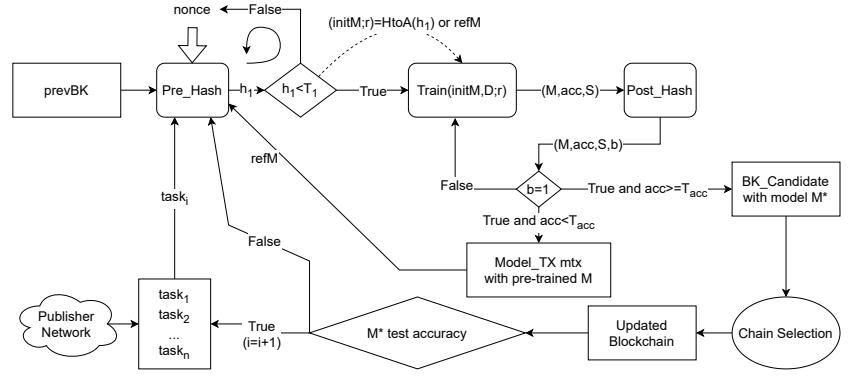
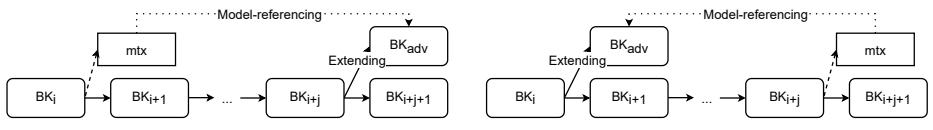

# Provably Secure Blockchain Protocols from Distributed Proof-of-Deep-Learning⋆

Xiangyu Su1 [,](https://orcid.org/0000-0002-1319-6394) Mario Larangeira1,2 [,](https://orcid.org/0000-0001-7168-898X) and Keisuke Tanaka[1](https://orcid.org/0000-0003-1330-4495)

1 Department of Mathematical and Computing Science, School of Computing, Tokyo Institute of Technology, Tokyo-to Meguro-ku Oookayama 2-12-1 W8-55, Japan. {su.x.ab@m,mario@c,keisuke@is}.titech.ac.jp 2 Input Output Global, Singapore. mario.larangeira@iohk.io

Abstract. Proof-of-useful-work (PoUW), an alternative to the widely used proof-of-work (PoW), aims to re-purpose the network's computing power. Namely, users evaluate meaningful computational problems, e.g., solving optimization problems, instead of computing numerous hash function values as in PoW. A recent approach utilizes the training process of deep learning as "useful work". However, these works lack security analysis when deploying them with blockchain-based protocols, let alone the informal and over-complicated system design. This work proposes a distributed proof-of-deep-learning (D-PoDL) scheme concerning PoUW's requirements. With a novel hash-traininßg-hash structure and model-referencing mechanism, our scheme is the first deep learningbased PoUW scheme that enables achieving better accuracy distributively. Next, we introduce a transformation from the D-PoDL scheme to a generic D-PoDL blockchain protocol which can be instantiated with two chain selection rules, i.e., the longest-chain rule and the weight-based blockchain framework (LatinCrypt' 21). This work is the first to provide formal proofs for deep learning-involved blockchain protocols concerning the robust ledger properties, i.e., chain growth, chain quality, and common prefix. Finally, we implement the D-PoDL scheme to discuss the effectiveness of our design.

Keywords: (Weight-based) blockchain protocols · Proof-of-useful-work · Distributed proof-of-deep-learning.

# 1 Introduction

A promising new line of research is to consider the substitution of proof-of-work (PoW) with "useful work", i.e., proof-of-useful-work (PoUW) [\[3\]](#page-21-0), in distributed

⋆ This work was supported by the JST CREST under Grant JPMJCR14D6, through the JST OPERA, through the JSPS KAKENHI under Grant JP16H01705 and Grant JP17H01695, through the JST CREST Grant Number JPMJCR2113, through the JSPS KAKENHI JP21H04879 and JP21K11882.

environments such as blockchain systems. This work focuses on the subset of these protocols, namely the deep learning-based PoUW schemes. First, we describe a brief but extensive survey of the research literature on deep learningbased schemes. The list is surprisingly short, considering the wide range of its applications. Our motivation is to formalize and extend these schemes so that we can achieve better use of computing power in blockchain-based protocols.

### 1.1 Background and Related Work

Recently, Chenli et al. [\[8\]](#page-21-1) propose a PoUW scheme that utilizes the training process of deep learning tasks as useful work. To the best of our knowledge, there are only a handful of papers targeting the same problem [\[2,](#page-21-2)[7,](#page-21-3)[8,](#page-21-1)[14](#page-22-0)[–16\]](#page-22-1). We show a brief analysis to them in the following.

As a starting point, all these works involve task publishers who control the publication of deep learning tasks and miners who intend to solve the given tasks. Except for Proof-of-Learning (PoLe) [\[14\]](#page-22-0), task publishers are forbidden to perform as miners under the assumption of limited computing power, whereas, PoLe [\[14\]](#page-22-0) discards this impractical assumption by adding secure mapping layers during model training. However, this approach also prevents miners from collaborating, which violates our goal. A deep learning task consists of a description, a training dataset, a potential test dataset, and an accuracy target threshold. In Proof-of-Deep-Learning (PoDL) [\[8\]](#page-21-1), Li et al.'s work [\[15\]](#page-22-2) and PoLe [\[14\]](#page-22-0), miners are required to train a model on the training dataset, and the model is verified according to the test dataset and test accuracy. This approach requires a strong synchronous network assumption because the task publisher has to publish the test dataset after miners produce their trained model. Otherwise, an adversary can directly train its model based on the test dataset.

DLchain [\[7\]](#page-21-3) overcomes the strong synchronous assumption by removing the test dataset-based verification. Instead, it focuses on improving training accuracy. In order to verify a trained model efficiently, DLchain utilizes a merkletree-based verification [\[9\]](#page-21-4) to check training history. Moreover, DLchain considers a similar goal to distribute PoDL, i.e., achieving better accuracy distributively. They partially fulfill the goal with priorly determined "short-term targets" which are accuracy targets below the threshold. Miners can generate blocks once their models surpass a short-term accuracy target. However, considering only training accuracy may result in overfitting, and determined short-term targets can affect blockchain growth rate, which may weaken the security of the protocol [\[11\]](#page-22-3).

CoinAI [\[2\]](#page-21-2) is a descriptive work that proposes an outline for designing a deep learning-based PoUW and proof-of-storage scheme. The authors propose a "hash-to-architecture" mapping based on format context-free grammar. It maps a hash value to an initial deep learning model concerning model architectures, including hyper-parameters and initial learnable-parameters. The hash-toarchitecture technique is vital for security since it prevents miners from grinding initial parameters. However, the security impacts are not clarified due to the lack of formality in [\[2\]](#page-21-2). Instead of proposing a PoUW-based blockchain protocol, Lihu et al. [\[7\]](#page-21-3) aim at taking blockchain's security to enhance artificial intelligence systems. However, the protocol requires a dedicated blockchain structure and suffers from complicated system design. For example, participants must select their role before execution, and a unique type of participant called the supervisor needs to monitor all message history during the execution. Thus, their work cannot be integrated into any current blockchain-based protocols.

To sum up, none of these works can serve as a fully distributive deep learning task solver, which is more desirable in distributed environments. Another crucial problem is the lack of proper security analysis of the blockchain protocol. For example, only DLchain [\[7\]](#page-21-3) provides security proof against double-spending attacks. However, a secure blockchain protocol should satisfy robust ledger properties, i.e., the chain growth, chain quality, and common prefix. Therefore, our motivation for this work is to overcome the problems in the deep learning-based PoUW schemes mentioned above, i.e., (1) to remove strong or impractical assumptions; (2) to distribute the computation of deep learning-based PoUW; (3) to provide concrete and thorough security analysis for blockchain protocols based on our extended scheme. Next, we further detail our work's significance.

### 1.2 Our approach and Results

This work proposes a distributed proof-of-deep-learning (D-PoDL) scheme by extending deep learning-based PoUW schemes so that provers can work collaboratively on given tasks. Note that the term "distributed" in D-PoDL differs from distributed deep learning, i.e., we do not require provers to perform a single training course together but let them train atop published pre-trained models.

Intuitively, D-PoDL provers train a model from a given deep learning task as their useful work. We propose a "hash-training-hash" structure to achieve adjustable difficulty while preventing provers from cherry-picking initial parameters (grinding attack) and pre-computing task instances (pre-computation resilience). As a result, the provers output a trained model with the corresponding accuracy and step number for D-PoDL verifiers to check. Another novelty of our scheme lies in how we handle intermediate models. Throughout the paper, an intermediate model, also called a pre-trained model, is a model "somewhat" trained yet failing to meet a given accuracy or security level. Instead of discarding such a model, we propose "model-referencing" that enables any prover to reference the pre-trained model. Hence, provers can start their training process atop the referenced model. Moreover, a referenced model will be rewarded so that even if the prover fails to meet the goals, it is incentivized to do more training iterations. We emphasize that this approach forms the distributed training process among provers, and such a design is never discussed in any previous work.

The second contribution is that we build a generic blockchain protocol based on our proposed D-PoDL scheme. We clarify the roles of participants: task publishers, miners, and external storage providers. Instead of assuming task publishers' inability to train models properly, we enable them to perform as miners while preventing them from pre-computing deep learning tasks with the hashtraining-hash structure. Only Pole [\[14\]](#page-22-0) shares the same property by embedding secure mapping layers into its training algorithm. Moreover, we make use of both training and test datasets. Concretely, miners (D-PoDL provers) extend the blockchain with models that have better training accuracy. In order to mitigate the overfitting problem while avoiding the strong synchronous network setting, we require miners to work on each deep learning task for multiple time slots. Hence, task publishers can evaluate the produced models with test dataset and select according to test accuracy. Since the training process is publicly verifiable, task publishers cannot take advantage by training directly on the test dataset. We will also discuss model verification and storage issues in Section [3.3](#page-7-0) and Section [4.1.](#page-10-0)

Furthermore, the generic D-PoDL-based blockchain protocol is capable of two different chain selection rules: i.e., the conventional "longest-chain rule" [\[11\]](#page-22-3) and the "weight-based" framework [\[12,](#page-22-4)[13\]](#page-22-5). The former requires honest miners to choose the longest branch as their chain whenever a fork occurs. In contrast, the weight-based framework assigns blocks with weights according to their quality. Hence, honest miners choose the branch with higher accumulated weight as their chain. Although the longest-chain rule can be considered a special case of the weight-based framework, we separate them into two concrete protocols and prove the robust ledger properties for each. Finally, we implement our D-PoDL scheme and compare it to existing schemes.

Table [1](#page-3-0) compares our work and related works. Note that we omit CoinAI [\[2\]](#page-21-2) due to its informality and Lihu et al.'s work [\[16\]](#page-22-1) due to their different research focus. We also include a recent result on stochastic local search-based PoUW [\[10\]](#page-22-6). The difference between our work and the PoUW [\[10\]](#page-22-6) is that we leverage deep learning characteristics, e.g., verifiable training steps and test datasets, and derive a simple yet versatile protocol (i.e., proven secure under different chain selection rules).

|                   | Work Evaluation                     | Network       | Publisher | Distributed | Formal   |
|-------------------|-------------------------------------|---------------|-----------|-------------|----------|
| Protocols         |                                     | Synchronicity | As Miner  | Task Solver | Security |
| Chenli et al. [8] | Test accuracy                       | Strong        | X         | X           | X        |
| Lan et al. [14]   | Test accuracy                       | Strong        | ✓ 1    | X           | X        |
| Li et al. [15]    | Training accuracy                   | Bounded       | X         | X           | X        |
|                   | Chenli et al. [7] Training accuracy | Bounded       | X         | △2          | △3       |
| Fitzi et al. [10] | —4                                  | Bounded       | ✓         | ✓           | ✓ 5   |
| This work         | Training and test                   | Bounded       | ✓         | ✓           | ✓ 6   |

Table 1: Comparison with Previous Works

Notes: (1) By secure mapping layers; (2) By pre-determined short-term targets; (3) Against double-spending attack; (4) Stochastic local search; (5) Under the longest-chain rule [\[11\]](#page-22-3); (6) Against robust ledger properties under the longest-chain rule [\[11\]](#page-22-3) and the weight-based framework [\[12,](#page-22-4) [13\]](#page-22-5).

### 1.3 Paper Organization

The remainder is organized as follows. Section [2](#page-4-0) reviews notations and the execution model of our blockchain protocol. The following two sections present our main contribution: blockchain protocols from distributed proof-of-deep-learning (D-PoDL). Concretely, Section [3](#page-5-0) introduces the formal definition of D-PoDL scheme and explains our design choices based on PoUW requirements; Section [4](#page-9-0) transforms the D-PoDL scheme into a generic blockchain protocol and presents two concrete protocols by instantiating the chain selection rule with the conventional longest-chain rule [\[11\]](#page-22-3) and the weight-based framework [\[12,](#page-22-4) [13\]](#page-22-5). We analyze the security of our concrete protocols regarding robust ledger properties in Section [5.](#page-14-0) Then, Section [6](#page-19-0) provides an implementation of the D-PoDL scheme to compare with existing algorithms. Finally, Section [7](#page-20-0) concludes this work.

# 2 Preliminaries

Throughout this paper, we use λ for the security parameter. For an integer k ∈ N, [k] denotes the set {1, . . . , k}. Given a set X, x \$ ← X denotes that x is randomly and uniformly sampled from X. For an algorithm Alg, x ← Alg denotes that x is assigned the output of an algorithm Alg on fresh randomness. Let Hash denote a collision-free hash function.

Moreover, we employ and modify the hash-to-architecture mapping mechanism from [\[2\]](#page-21-2), which is based on the formal context-free grammar and is used to establish a surjective function between a hash value and a proper deep learning architecture setup. Denote the original hash-to-architecture mapping with HtoA∗ , i.e., given a hash value h, HtoA∗ (h) = (A(hpp), initLP) where A(hpp) is the architecture A concerning hyper-parameters hpp, and initLP denotes the initial learnable parameters. Our modification, denoted by HtoA, is to generate an additional random value from the hash, i.e., given a hash value h = h1||h2 and a hash function Hash : {0, 1} ∗ → {0, 1} λ , we extract r = Hash(h2) and run HtoA∗ (h1) = (A(hpp), initLP) so that the outputs of HtoA(h) is (A(hpp), initLP, r).

Protocol execution model. Protocol executions are modeled by the standard Interactive Turing Machines (ITM) approach [\[6\]](#page-21-5). A protocol refers to algorithms for a set of nodes (users) to interact with each other. All corrupted nodes are considered to be controlled by an adversary A who can read inputs and set outputs for these nodes. We present our protocol settings as follows.

Time and network. We assume the protocol execution proceeds in rounds, which corresponds to the smallest unit of time of interest. The network is synchronous with a known bounded delay δ time on the delivery time, i.e., any message sent by an honest node in round r is guaranteed to arrive at all honest nodes until round r + δ;

Corruptions. We allow the adversary to corrupt up to β < 1 2 fraction of nodes before each round, i.e., a corrupted node is under the adversary's complete control from the round. We also assume the adversary is rushing, i.e., it receives honest users' messages first and decides the order of message delivery or whether to inject messages for each recipient.

# 3 The D-PoDL Scheme

As an extension of deep learning-based PoUW schemes, our D-PoDL scheme provides an interface for its provers to solve a deep learning task together. Like PoUW, a D-PoDL scheme involves two types of participants: provers and verifiers. On a given deep learning task, a prover intends to output a trained model, and claims the corresponding training accuracy and step number. Whereas, a verifier checks if the model matches the prover's claims and responds accordingly. This section presents the D-PoDL scheme in terms of requirements and syntax. We focus on a setting where provers work on a priorly given deep learning task with a designed target threshold. We clarify that the scheme focuses on solving the task and verifying the model. Discussions about task selection, block generation, and blockchain dynamics can be found in the protocol description in later sections, i.e., Section [4](#page-9-0) and Section [5.](#page-14-0)

D-PoDL requirements. A D-PoDL scheme should satisfy the same security requirements [\[10\]](#page-22-6) as the PoUW, i.e., no-grinding, pre-computation resilience, and adjustable difficulty. Moreover, it should satisfy efficiency and usefulness requirements. The requirements are (1a) No-grinding: The adversary cannot cherrypick hyper-parameters to gain training advantages, i.e., less training steps with higher accuracy; (1b) Pre-computation resilience: The adversary cannot manufacture problem instances to train the model faster; (1c) Adjustable difficulty: The block difficulty (measured by training accuracy) can be adjusted to the computing power of the network; (2a) Efficient verification: The running time of the verification algorithm should be at most poly-logarithm of provers' training time; (2b) Measurable usefulness: The usefulness of a training process can be quantified and compared to each other.

### 3.1 Design Overview

Along with the two processes in a D-PoDL scheme, i.e., solving a deep learning task and verifying the correctness of the solution, we propose a novel "hashtraining-hash" structure for the solving process and utilize a widely used merkletree-based verification procedure [\[9\]](#page-21-4) as a black-box for the verification process. Additionally, we propose a weighting algorithm to evaluate a weight function that quantifies a solution's usefulness. We describe the "hash-training-hash" structure briefly in this section. More details of our design choices can be found after the formal definition.

Intuitively, on a given deep learning task, we enable provers to initialize its solving algorithm with either a fresh or a pre-trained model from any prover, i.e., for "model-referencing". The first hash requires provers to perform a proof-ofwork (PoW) with threshold T1, i.e., a prover needs to find a nonce such that the hash value of the previous block, potentially a pre-trained model and the nonce is less than T1. If the hash value passes the PoW check (less than T1), the prover can map the hash value to an architecture with respect to hyper-parameters, (initial) learnable-parameters and a random seed with our modified hash-toarchitecture algorithm. As introduced in Section [2,](#page-4-0) the architecture (with hyperparameters) and learnable-parameters determine a deep learning model. The prover trains the model by updating learnable-parameters iteratively. The posthash checks the output model against threshold T2 to decide if the models are eligible for publishing. If the post-hash fails, the prover can return to the prehash or training process. The prover must perform more training iterations in both cases to generate a valid model.

### 3.2 Formal Syntax and Construction

A D-PoDL scheme involves a tuple of algorithms (Setup, Solve, Verify, Weight). Setup extracts a training dataset and a designed target threshold from a deep learning task. Solve consists of three sub-algorithms PreHash, Train, and PostHash. In general, PreHash determines the initial model, including its architecture, hyper-parameters, learnable-parameters, and a random seed. Train casts the training process and outputs a model with the corresponding accuracy and step number. Note that we do NOT restrict the training algorithm to provide generality for our design. Instead, as we will show in Section [5.1,](#page-15-0) we model it with an oracle due to its stochastic nature and model provers' computing power by their capability of oracle queries. Next, due to security concerns, PostHash returns a bit according to a hash proof. Verify verifies the trained model's validity concerning accuracy. Weight is available to both provers and verifiers, and it evaluates a weight function w : acc × Tacc → R, which maps the model's accuracy and a priorly decided target threshold to a real value. We present the formal syntax and construction of the D-PoDL scheme as follows.

Construction 1 (D-PoDL Scheme) Given the hash-to-architecture algorithm HtoA(·) from Section [2](#page-4-0) and the weight function w : acc × Tacc → R, the tuple algorithm of a D-PoDL scheme (Setup, Solve, Verify, Weight) works as follows:

- Setup(1λ ,task) takes as input the security parameter λ and the description of a deep learning task task from the task publisher. Setup extracts the public parameter pp and a pair of threshold (T1, T2) for security concerns from the system. It parses the task with a training dataset D and a target threshold Tacc. Setup outputs (pp, T1, T2, D, Tacc). We omit pp later for simplicity;
- Solve((T1, prevBK,refM),(D, Tacc), T2). We divide Solve into three algorithms: (PreHash,Train, PostHash).
	- PreHash(T1, prevBK,refM) takes as input T1, a previous block prevBK and potentially a pre-trained model refM. It samples nonce such that Hash(prevBK,

refM, nonce) = h1 ≤ T1. If refM =⊥, PreHash runs HtoA(h1) = (A(hpp), lp, r) where A(hpp) denotes the architecture, lp denotes the learnable-parameters, and r denotes the random seed. It sets initM = (A(hpp), lp); Otherwise, It parses refM = (A(hppref), lpref) and sets initM ∈ {refM,(A(hpp), lp)}. Then, PreHash returns (nonce, initM, r);

- Train(D, Tacc, initM, r) takes as input the training dataset D, a target threshold Tacc, a initial model initM and a random seed r. It parses initM = (A(hpp), lp) and trains the model by updating learnable-parameters iteratively. Train returns M = (A(hpp), lp∗ ), the corresponding training accuracy acc ∈ [0, 1], step number S and a list of checkpoints CPs ∆= {(Mi , acci , Si)} where each entry denotes an intermediate result of the training process;
- PostHash(T2, M, acc, S) takes as input T2 and a model M with the corresponding accuracy acc and step number S. It computes Hash(M, acc, S) = h2. If h2 ≤ T2, PostHash returns 1; Otherwise, it returns 0.

Finally, Solve outputs ((refM, nonce, initM, r),(M, acc, S), b) where b ∈ {0, 1};

- Verify((T1, prevBK,refM, nonce, initM, r),(D, Tacc, M, acc, S, CPs),(T2, b)) checks: • If Hash(prevBK,refM, nonce) = h1 ≤ T1 and if initM is derived correctly from refM;
	- If M is trained correctly from initM with Train according to (S, CPs) and if the corresponding accuracy acc′ = acc;
	- Compute PostHash(T2, M, acc, S) = b ′ and check if b ′ = b.
- If the situations above are satisfied, Verify outputs 1; Otherwise, it outputs 0.
- Weight(acc, Tacc) evaluates the weight function w and outputs w ∈ R.

# 3.3 Design Choices Explanation

Here, we explain our construction choices with respect to the requirements.

Setting up initial models with pre-hash. There are countless different architectures in deep learning, each with its characteristics and limitations. After selecting an appropriate architecture A, provers need to choose hyperparameters and initial learnable-parameters for the model, which may affect the speed and quality of the training process. Usually, hyper-parameters are not learnable, so provers must go through random sampling before obtaining a good set of hyper-parameters. However, we may open a gate for grinding attacks (Requirement 1a) if we offer provers the ability to choose hyper-parameters and initial learnable-parameters. An adversary may outperform honest users' training speed and quality by cherry-picking.

In order to mitigate this problem, we adopt the same approach as in Ofelimos [\[10\]](#page-22-6). Concretely, we rely on a PoW scheme with threshold T1, which requires provers to sample a nonce nonce randomly and compute the hash of the previous block (prevBK), potentially a pre-trained model refM with the nonce such that Hash(prevBK,refM, nonce) = h1 ≤ T1. The hash function's uniformity prevents provers from grinding hyper-parameters and learnable-parameters. Note that our T1 should not be as hard as a stand-alone PoW, e.g., the one in the Bitcoin system, because we intend to encourage provers to train models instead of solving PoW. Finally, if refM is empty, the prover needs to generate an initial model with HtoA(h1) = (A(hpp), lp, r) such that initM = (A(hpp), lp); Otherwise, the prover can either refer to the pre-trained model refM = (A(hppref), lpref) or use the freshly generated hyper-parameters and the pre-trained learnableparameters (A(hpp), lpref) as its initial model. In this case, the pre-hash enforces provers to establish links from their model to previous blocks and the referenced models. Such links are crucial to the security of model-referencing.

Model-referencing and pre-computation resilience. An initial model can be sampled from HtoA or from a pre-trained model refM. The purpose of taking as input a pre-trained model is to enable provers to work atop any valid but not-good-enough model. Hence, we prevent their computing power from being wasted and form a distributed solver for given deep learning tasks. However, starting from a pre-trained model can shorten the prover's training iteration because these models may be only a few steps from reaching the accuracy target threshold. For example, an adversary may steal an honest prover's outputs (M0, acc0, S0) and produce a new model MA with accuracy accA ≥ Tacc ≥ acc0 and a claimed step number SA. Such an attack violates pre-computation resilience (Requirement 1b) because the adversary achieves better accuracy while performing only (SA − S0) training steps.

In order to tackle this problem, we design a novel mechanism called "modelreferencing". We require provers to make references if their models are trained based on another model. Otherwise, their models are regarded as invalid. The reference is (prevBK,refM, nonce), which can be publicly verified with Hash(prevBK, refM, nonce) ≤ T1. Hence, model-referencing enables provers to train each others' models together for the same goal (surpassing the target threshold and post-hash check threshold) while preventing them from stealing others' models (by discarding those "use-without-reference" models). Furthermore, the provers should only reference the latest models, i.e., if two pre-trained models share the same setup, provers should reference the model with higher accuracy and step number. With this setting, we also prevent provers from flooding the system with too many pre-trained models. Therefore, the mechanism inherently forms an additional "link" (like the hash link between blocks) that connects models, i.e., a valid block must be linked to a previous block and a previous model. More details can be found in Section [4.1.](#page-10-0)

Adjusting computation with post-hash. One argument concerning the adjustable difficulty (Requirement 1c) is that training a model so that its accuracy surpasses the target threshold Tacc should be harder than finding a nonce to meet the PoW puzzle with threshold T1. Otherwise, the computational difficulty is determined by the PoW rather than the training process, which violates the usefulness of our scheme. Hence, we propose a solution based on [\[5\]](#page-21-6)'s approach, which requires the provers to perform one "post-hash" against a threshold T2 to decide if their models are eligible for publishing. If a model fails the posthash, the prover must revert to the pre-hash or training process. The threshold T2 guarantees the overall security and usefulness level for our scheme, e.g., to preserve the 10 minutes interval for block generation while enforcing provers' computation focus on model training instead of PoW. We will show the impact of the post-hash algorithm during our implementation of the D-PoDL scheme in Section [6.](#page-19-0)

Model verification. In order to verify the outputs of a prover, a verifier needs to check three conditions: (1) If the nonce satisfies the PoW check with threshold T1; (2) If the model has the claimed accuracy; (3) If the post-hash outputs a correct bit. In this section, we focus on verifying the model and its accuracy. A naive approach is to check the prover's model with the given training dataset. However, it takes as many iterations as the training algorithm, which violates the efficiency requirement (Requirement 2a).

We solve this problem by adopting the widely used merkle-tree-based verification [\[9\]](#page-21-4) as a black box. This approach is also mentioned in the previous work [\[7\]](#page-21-3). Namely, provers are required to include several intermediate results as checkpoints into their training outputs and build a merkle-tree accordingly. Hence, verifiers only need to check the validity of these checkpoints. Given n checkpoints, the time complexity for verifiers can be reduced to O(polylog(n)) at the cost of provers' space complexity being O(poly(n)). Moreover, there is a trivial trade-off between the interval of two checkpoints and the granularity of the check. As pointed out by [\[7\]](#page-21-3), the interval setting can be left to users in real-life applications and adjusted according to accuracy thresholds. However, since each checkpoint has the size of a model, we explain this in Section [4.1](#page-10-0) with respect to external storage providers.

Measuring usefulness. The D-PoDL scheme focuses on improving the models' training accuracy, whereas, the test accuracy is left for the protocol. Except for the conventional longest-chain-based blockchain protocols [\[11\]](#page-22-3), we intend to build our D-PoDL scheme under a weight-based framework by [\[13\]](#page-22-5). In such a setting, blocks are assigned with weight, and the chain is selected based on the accumulated weight. We argue that the weight-based approach is natural for the D-PoDL scheme because accuracy can be regarded as a quantified measurement for usefulness (Requirement 2b). Moreover, we can generalize the weight-based approach to arbitrary PoUW schemes as long as their usefulness is measurable.

# 4 Our D-PoDL Blockchain Protocols

This section describes the transformation from our D-PoDL scheme to D-PoDLbased blockchain protocols. As mentioned in the execution model from Section [2,](#page-4-0) our protocol proceeds in rounds. Honest users may share a slightly different view of the round number. We further divide our protocol execution into time slots. Each time slot is associated with a deep learning task, and the time slot ends when a validly generated block is added to the blockchain. Thus, a time slot may include multiple rounds. Considering the workflow within a time slot, we propose a generic D-PoDL blockchain protocol design as in Figure [1.](#page-10-1) Then, two concrete protocols are derived from the generic design by instantiating the chain selection rule with the longest-chain rule [\[11\]](#page-22-3) and the weight-based framework [\[13\]](#page-22-5). Finally, we discuss the incentive model of our protocols.

Fig. 1: Design of our Generic D-PoDL Blockchain Protocol

### 4.1 Generic Protocol Workflow

The generic blockchain protocol involves three types of participants: task publishers, miners, and external storage providers. Task publishers handle deep learning tasks. Each task is associated with a dataset and desired accuracy thresholds. Task publishers first split the dataset into a training dataset and a test dataset. They publish the task description, the training dataset, and the corresponding desired training accuracy as the target threshold. Miners perform the protocol by generating and verifying blocks according to the D-PoDL scheme's instructions. Concerning the size of deep learning models and checkpoints (which are the same size as models), we employ the approach from [\[7\]](#page-21-3) to prevent storage overhead, i.e., embedding only a downloadable link within the block and relying on external storage to store the whole model and checkpoints.

Task publication. We start our generic D-PoDL blockchain protocol from the task publication mechanism. In order to keep the task publication as generic as possible, we consider a situation in which these publishers form a network to publish and decide the order of tasks. They aim to organize a distributed solver for deep learning tasks and can be benefited from receiving the solutions. The only requirement is that the outputs of the publisher network should be an

ordered list of deep learning tasks. We denote the output as {taski}i∈[n] where taski spans over a period of ℓi time slots in Ti = {ti,j}j∈[ℓi] .

Note that we do NOT separate task publishers from miners, i.e., a task publisher can participate in the protocol as a miner and gain mining rewards. We argue that the task publisher cannot pre-compute the task to gain advantages over regular miners due to the pre-hash algorithm and the model-referencing mechanism. Without loss generality, let the current time slot be tp,q, we consider an adversarial publisher who intends to pre-compute deep learning task taski where i > p, q ∈ [ℓp]. Since i > p, without pre-trained models, the publisher has to train an initial model generated from HtoA, i.e., to find nonce such that Hash(prevBK, nonce) = h1 ≤ T1 where prevBK associates with slot ti−1,ℓi−1−1 ∈ Ti−1 and compute initM from HtoA(h1). To find such a nonce requires the publisher to either predict the block in the future or find a collision in the hash function. Since the probabilities of both cases are negligible, the publisher cannot produce a trained or pre-trained model to pass the D-PoDL scheme's verification by pre-computing taskk.

Execution of D-PoDL scheme. Now, we consider a deep learning task taski given to miners in time slot ti,j where j ∈ [ℓi ]. Each miner runs as a prover of the D-PoDL scheme. The Setup algorithm first extracts public parameters, a training dataset, and thresholds (T1, T2, Tacc). The miner then finds a nonce and initializes initM with PreHash; It runs the training course on the initial model with the randomness r to obtain a model M, the corresponding accuracy acc and step number S; PostHash tests the model according to T2 and outputs a bit b. The miner outputs a tuple, including potentially a pre-trained model as the reference, a nonce, an initial model, a random training seed, a trained model with the corresponding accuracy and step number, and a post-hash check bit.

According to the post-hash check, the miner decides if its model is eligible for publishing. Moreover, for generality, we introduce a relation between the model accuracy and the target threshold as R(acc, Tacc), which will be instantiated in concrete protocols. Hence, when b = 1∧R(acc, Tacc) = 1, the miner collects transactions from the mempool as in conventional blockchain protocols and generates a block candidate embedding the obtained model M; Otherwise, the miner generates a special model-transaction mtx for model-referencing, which contains the outputs of the Solve algorithm, i.e., mtx = (prevBK,(refM, nonce, initM, r),(D, Tacc, M, acc, S, CPs), 1). mtx is published into the mempool as ordinary transactions. Any miner can reference the model M in the model-transaction mtx by including mtx in the miner's newly found block or model-transaction. That is, the miner takes as input refM′ = M for its Solve algorithm. Note that different miners can refer to the same model-transaction. We do not count this as "doublespending" since no ordinary (money-used) transaction is involved. Newly trained models still need to compete for acceptance. Moreover, miners can reference model-transactions recursively, i.e., generating a model-transaction mtx′ with higher accuracy from mtx is acceptable. The only restriction here is that miners must reference the latest model-transaction, which embeds a pre-trained model with the highest accuracy observed so far. This prevents the adversary from releasing a large amount of model-transaction to DoS attack [\[17\]](#page-22-7) the network.

Cross time slot attacks and restrictions on step number. We leave block selection (with respect to forks) to concrete protocols in Section [4.2.](#page-13-0) Here, we consider the whole period (a span of time slots) associated with a deep learning task. Once the blockchain gets updated, miners proceed to the next time slot. A task can span over multiple time slots so that the publisher network can check each selected model with the corresponding test dataset. This approach is to mitigate the trend toward overfitting models since miners are given only training datasets to overcome the strong synchronous network assumption.

However, this approach allows adversaries to reference models generated in different time slots from the block they extend. Given a fragment of the blockchain that associates with a deep learning task, we illustrate two attack strategies in Figure [2a](#page-12-0) and [2b.](#page-12-0) Note that the adversary can also reference models embedded in blocks. We use model-transactions here for generality.

(a) The adversary intends to extend block bki+j by referencing an mtx that links to block bki.

(b) The adversary intends to extend block bki by referencing a model-transaction mtx that links to block bki+j .

Fig. 2: Intuition of Cross Time Slot Attacks

The first attack enables the adversary to extend the blockchain with fewer training steps while not violating model-referencing requirements. In the second attack, the adversary can produce a model with higher accuracy or weight using new information, e.g., the model in mtx of Figure [2b.](#page-12-0) This attack may subvert blockchain history if the adversary produces enough blocks to compete with the selected chain.

In order to tackle these problems, we restrict the training step number in published blocks. We introduce a lower bound of acceptable step number as Smin to control the selected blocks' step number during the period of a given task task. Denote the period with T = {ti}i∈[ℓ] , and for each i ∈ [ℓ], we denote the selected model (in a block on the chain) with Mi ∈ bki and the model's corresponding step number with Si . Now, consider a block candidate bk embedding Mbk trying to extend bkn with n ∈ [ℓ−1]. Let M = (M′ j )j∈[k] be Mbk's recursively referenced model list. Each of these models is either embedded in a block or a model transaction that extends some blocks on the blockchain. Without loss of generality, we assume the first block being extended by one of these models in the period to be bkm where m ∈ [ℓ − 1], m ≤ n. The restriction on Mbk's step number Sbk

is: Pk−1 j=0 S ′ j + Sbk ≥ Pn−1 i=m Si + Smin. Intuitively, the restriction requires that a newly generated block and its referred models have no less training steps than the steps on the main blockchain. It is reasonable in the sense that we require not only the accuracy of models/blocks, but also miners donating enough computing power (training steps). Moreover, our D-PoDL scheme enables us to leverage steps in model verification. The goal is to stabilize the block generation rate, and we will discuss this later in Section [5.2.](#page-16-0) Finally, miners repeat the above process when the publisher network proceeds to a new task.

# 4.2 Concrete Protocols

In this section, we instantiate the chain selection rule with the longest-chain rule from [\[11\]](#page-22-3) and the weight-based framework from [\[13\]](#page-22-5).

Longest-chain-based D-PoDL blockchain. First, in the longest-chain-based protocol, we clarify the relation introduced above as: R(acc, Tacc) = 1 if acc ≥ Tacc. Hence, a model is eligible to be published as a block if b = 1 ∧ acc ≥ Tacc. Otherwise, i.e., acc < Tacc, the model can be embedded in a model-transaction mtx and published to the mempool; if b = 0, the miner must continue training the model or resample the nonce for another initial model to be trained. By the longest-chain rule, miners of each time slot add blocks to the end of the longest blockchain they have observed and broadcast the chain to the network. Later, we will show that forks of the same length as the main chain can exist only with negligible probability by proving the robust ledger properties [\[11\]](#page-22-3) for our longest-chain-based protocol.

Weighted-based D-PoDL blockchain. In the weight-based protocol, R(acc, Tacc) = 1 for any pair of (acc, Tacc). The situation indicates that a miner can generate a block even if its deep learning model fails to surpass the target threshold. However, the number of blocks produced in a time slot can be overwhelming without proper filtering. Therefore, Kamp et al. [\[13\]](#page-22-5) introduce a weight function to quantify the quality of blocks so that miners only choose the blockchain with the highest (accumulated) weight. Our weight function evaluates the embedded model according to (acc, Tacc) with the Weight algorithm. Instead of showing specific constructions, we will introduce two crucial properties for proving the security of the weight-based D-PoDL blockchain in the next section. With these properties, we show that forks with comparable weights as the main chain can only exist with negligible probability by proving the weight-based variant of robust ledger properties [\[13\]](#page-22-5) for our weight-based protocol.

Discussion: Incentive models. The incentive model is crucial to a practical protocol. We aim to reward miners according to their useful computation, i.e., training iterations. Moreover, our protocol differs from previous works in that miners can reference model-transactions to generate another model-transaction, or a block, without training models from the sketch. Models in model-transactions may have inferior accuracy. However, they are crucial in forming the distributed deep learning task solver. Hence, in order to incentivize miners to produce models, we reward not only the miners who produce selected blocks but also the modeltransactions referenced by selected blocks. The rewards are given according to the model accuracy and the step number. For example, let M be the selected model, which is trained for S steps. Furthermore, let its recursively referenced models set be M = {Mj}j∈[k] , and each j ∈ [k], Mj is trained for Sj steps. Hence, M's miner receives S/( PSj + S) fraction of the total rewards, and each Mj 's miner receives Sj/( PSj + S) of the total rewards. Finally, we want to clarify that incentive models may affect the assumptions on honest miners' fraction, which will further affect chain growth for robust ledgers [\[1\]](#page-21-7). However, this work assumes honest miners' fractions directly. Hence, the incentive model in this section will not change our security proofs.

# 5 Security Analysis

Our security analysis focuses on the period of one single deep learning task because switching to a new task can be regarded as a mining difficulty shift in the PoW-based protocols. However, extending the result to the whole blockchain is easy if we assume the difficulty, represented by the accuracy target threshold, is stable across different tasks. To clarify, the terms "model-transaction" and "block" refer to the model embedded in the model-transaction or block.

Robust ledger properties. In this work, we focus on proving the robust ledger properties, i.e., the chain growth, chain quality, and common prefix, for our concrete protocols. The definitions originate from [\[11\]](#page-22-3). We adopt the modified version from [\[10\]](#page-22-6) for the longest-chain-based protocol. For completeness, we also include the weight-based variant from [\[13\]](#page-22-5).

# Definition 1 (Robust ledger properties).

- Chain Growth: For any honest miner with chain C at a round, the chain growth with parameter τ ∈ (0, 1] and s ∈ N states that for any portion of C spanning s consecutive rounds, the number of blocks in this portion is at least τs;
- Existential Chain Quality: For any honest miner with chain C at a round, the existential chain quality with parameter s ∈ N states that for any portion of C spanning s consecutive rounds, at least one honestly-generated block appears in this portion;
- Common Prefix: For any two honest miners with chains C1, C2 at round r1, r2 respectively, where r1 ≤ r2, the common prefix with parameter s ∈ N indicates that C1 should be a prefix of C2 after removing the last s blocks.

Definition 2 ((Weight-based) robust ledger properties). The three aspects are defined as follows.

– Chain Growth: For any honest miner with chain C at a round, the chain growth with parameter τ ∈ (0, 1] and s ∈ N states that for any portion of C spanning s consecutive rounds, the number of blocks appearing in this portion is at least τ · s (the accumulated weights W(C2) ≥ W(C1) + τs);

- 16 X. Su et al.
- Existential Chain Quality: For any honest miner with chain C at a round, the existential chain quality with parameter s ∈ N states that for any portion of C spanning s consecutive rounds, at least one honestly-generated block appears in this portion (the fraction of honest blocks' weights is at least µ;);
- Common Prefix: For any two honest miners with chains C1, C2 at round r1, r2 respectively, where r1 ≤ r2, the common prefix with parameter s ∈ N indicates that C1 should be a prefix of C2 after removing the last s blocks.

### 5.1 The Training Oracle

Our first step models the combination of training and post-hash process with a training oracle. Following [\[13\]](#page-22-5)'s approach, we assume protocol participants can make at most one query to the training oracle in each round. This assumption is reasonable because a round is the smallest unit of time of interest in our protocol and corresponds to the time for evaluating the hash function over one training iteration on one miner's computing device. For a real-world miner with the computing power of more than one device, we model it as a collection of "one-query-per-round" participants.

In each round, a miner queries the oracle OTrain with (Mpre, accpre, S; r) where Mpre denotes the pre-query model, accpre and S denotes the corresponding training accuracy and step number, and r denotes the random seed for training. The oracle OTrain first verifies the queried model and returns ⊥ if the model is invalid. Otherwise, OTrain performs one training iteration with r to obtain (Mafter, accafter, S+1) where Mafter and accafter denote the model and training accuracy after query, respectively. It samples a random value h2 ← {0, 1} λ uniformly, where λ is the security parameter that indicates the length of the hash function output. OTrain returns (Mafter, accafter, S+1, h2). Moreover, regarding queries with different random seeds (r) as different queries, OTrain keeps a list of performed queries and replies to former queries according to the list.

The uniqueness of our model is that OTrain performs one training iteration before sampling the random value. A query is said to be successful only if the output model satisfies: h2 ≤ T2 ∧ R(accafter, Tacc) = 1. Since h2's distribution is defined to be uniform, we now consider the distribution of the output accuracy accafter. Note that training accuracy usually grows faster before achieving a certain value. Like in [\[7\]](#page-21-3), we name this value difficulty threshold, denoted by Dacc. Our model focuses on the training process after such a threshold. The reason is that, as explained in [\[4\]](#page-21-8), increasing the training accuracy requires stochastic/random search after this threshold. Hence, we assume that if accpre ≥ Dacc, accafter follows an arbitrary distribution D over {acc : acc ≥ Dacc} such that f1 ∆= Pr[accafter ≥ Tacc|accpre ≥ Dacc], e.g., when D is uniform, f1 = 1−Tacc 1−Dacc . Otherwise, i.e., accpre < Dacc, we assume accafter increase be monotonically but unlikely to surpass Tacc, i.e., less than ϵ, negligible of the security parameter λ. Therefore, we argue that the overall probability is Pr[accafter ≥ Tacc] ≥ 1 2 f1 because the number of training steps before reaching the difficulty threshold is much less than the step number afterward. The training oracle goes as follows.

# Training Oracle OTrain

Let task be a deep learning task with dataset D and accuracy target threshold Tacc. The oracle OTrain keeps a list L with performed queries. On a query (Mpre, accpre, S; r) from a miner in a round:

- If (Mpre, accpre, S; r) is invalid, i.e., Mpre has unmatched accuracy or step number, return ⊥;
- If (Mpre, accpre, S; r) ∈ L, return the reply entry (Mafter, accafter, S+1) according to the list L;
- Otherwise, run one training step Train(D, Tacc, Mpre, r) → (Mafter, accafter, S+1) and sample h2 ← {0, 1} λ uniformly at random. Add ((Mpre, accpre, S; r),(Mafter, accafter, S+1, h2)) to L and return (Mafter, accafter, S+1, h2) to the miner.

We assume the distribution of accafter following the distribution D over {acc : acc ≥ Dacc} such that Pr[accafter ≥ Tacc|accpre ≥ Dacc] = f1, and Pr[accafter ≥ Tacc|accpre < Dacc] = ϵ where ϵ is negligible of the security parameter λ.

# 5.2 Proving Ledger Properties

Consider the situation in which a deep learning task taski spans over time slots Ti = {ti,j}j∈[ℓ] . We omit i in the following for simplicity. The hash function in the PreHash algorithm guarantees that a new block is never added between two existing blocks (insertions), the same block never occurs in two different positions (copies), and a block never extends a block that will be mined in later time slots (predictions).

The longest-chain-based protocol. A miner who outputs a block in slot tj that meets the post-hash check, target accuracy, and step restriction has to perform at least Sj training steps, which is equivalent to Sj queries to OTrain. As miners, honest or adversarial, are bounded by the number of queries they can make in each round, they cannot generate too many blocks in any polynomial many consecutive rounds within the period T of taski . Simultaneously, miners cannot generate too few blocks because the probability of at least one honest miner outputting a block is lower bounded by the success rate of the oracle.

Like [\[11\]](#page-22-3), we define typical execution for the situation in which miners generate not too many nor too few blocks in polynomial many consecutive rounds of protocol execution. First, we consider three Boolean random variables Xr, Yr, Zrpq. If at round r an honest miner obtains an output from the oracle OTrain that satisfies h2 ≤ T2 ∧ R(accafter, Tacc) = 1, then Xr = 1, otherwise Xr = 0. If at round r exactly one honest miner obtains such an output, then Yr = 1, otherwise Yr = 0. For the adversary, if at round r, the p-th corrupted miner's q-th query to the oracle OTrain obtains such an output, then Zrpq = 1, otherwise Zrpq = 0. Hence,

we define a variable Zr = P p P q Zrpq. For a set X of k consecutive rounds, we define X(X) = P r∈X Xr, Y (X) = P r∈X Yr, Z(X) = P r∈X Zr.

Definition 3 ((ϵ, k)-typical execution). Let ϵ ∈ (0, 1) and k ∈ N, an execution is (ϵ, k)-typical if for any set X of at least k consecutive rounds within the period of a deep learning task, the following holds:

– (1 − ϵ)E[X(X)] < X(X) < (1 + ϵ)E[X(X)],(1 − ϵ)E[Y (X)] < Y (X); – Z(X) < E[S(X)] + ϵE[X(X)].

Theorem 1. Assume the training oracle and at most β < 1 2 corrupted miners each round, the longest-chain-based D-PoDL blockchain protocol satisfies the robust ledger properties (Definition [1\)](#page-14-1).

Proof. We first prove the following lemma.

Lemma 1. An execution is (ϵ, k)-typical with probability 1 − e −Ω(ϵ 2kp) where p is the probability of at least one honest miner obtaining a model that satisfies h2 ≤ T2 ∧ acc ≥ Tacc.

Let accafter be the input accuracy to OTrain and Dacc be the difficulty threshold, according to our oracle description, the probability of the output accuracy accafter surpassing the target threshold Tacc in a query reply is:

$$\begin{split} \Pr[\mathsf{acc}\_{\text{after}} \ge T\_{\mathsf{acc}}] &= \Pr[\mathsf{acc}\_{\text{after}} \ge T\_{\mathsf{acc}} \land \mathsf{acc}\_{\text{pre}} \ge D\_{\mathsf{acc}}] \\ &+ \Pr[\mathsf{acc}\_{\text{after}} \ge T\_{\mathsf{acc}} \land \mathsf{acc}\_{\text{pre}} < D\_{\mathsf{acc}}] \\ &\ge \Pr[\mathsf{acc}\_{\text{after}} \ge T\_{\mathsf{acc}} | \mathsf{acc}\_{\text{pre}} \ge D\_{\mathsf{acc}}] \cdot \Pr[\mathsf{acc}\_{\text{pre}} \ge D\_{\mathsf{acc}}] \\ &= f\_1 \cdot \Pr[\mathsf{acc}\_{\text{pre}} \ge D\_{\mathsf{acc}}], \end{split}$$

For a query, we have Pr[accpre ≥ Dacc] ≥ 1/2, as we assumed training steps before reaching Dacc, which is less than the step number afterward. Thus, a miner who makes at least one query to OTrain in a round obtains accafter ≥ Tacc from OTrain with probability at least 1 2 · f1.

Let f2 be the probability of at least one honest miner obtaining an h2 from the training oracle OTrain that satisfies h2 ≤ T2 in a round. Because the output of the training algorithm is independent to the hash function, the probability of at least one honest miner obtaining a tuple (Mafter, accafter, S+1, h2) that satisfies h2 ≤ T2 ∧ accafter ≥ Tacc should be at least p ≥ 1 2 · f1 · f2 (and at most p ≤ f2).

Next, we analyze the probability of execution being typical. Note that the training oracle OTrain takes queries with different training random seeds (r) as different queries. Moreover, a hash function, modeled as a random oracle, generates such random seeds in the pre-hash PreHash algorithm. Hence, the probability of two honest parties querying OTrain with the same input in polynomial many rounds of execution is negligible of the security parameter λ. Such property enables us to condition the probability space on the event that no two honest parties query OTrain with the same input in a polynomial many rounds of execution. In this space, the random variables Xr (and similarly Yr and Zrpq) are independent Bernoulli trials where each trail is successful with probability Θ(p) (as analyzed above). Hence, by the Chernoff bound, we prove the probability of an (ϵ, k)-typical execution is 1 − e −Ω(ϵ 2kp) .

Directly from [\[11\]](#page-22-3), we have the following lemma that parameterizes the chain growth, existential chain quality, and common prefix in a typical execution.

Lemma 2. In an (ϵ, k)-typical execution, the chain growth property holds for parameter τ = (1−ϵ)p and s ≥ k, the existential chain quality property holds for parameter s ≥ 2kp, and the common prefix property hold for parameter s ≥ 2kp.

Finally, by Lemma [1,](#page-17-0) we choose k = Ω(log2 λ) so that an execution fails to be typical with negligible probability of the security parameter λ. Therefore, we prove Theorem [1](#page-17-1) with the parameters following Lemma [2.](#page-18-0)

The weight-based protocol. One concern is that selecting models with inferior accuracy may accelerate the block generation rate because training such models requires fewer steps in each time slot. The block may not be adequately propagated to all honest miners before the next block is generated. To prevent so, we require the weight function to be appropriately bounded (with isolatedlower-bounds and upper-bounds, definitions can be found in [\[13\]](#page-22-5)) so that the low block weight indicates low model accuracy and the low accuracy models are hard to be selected according to the weight function. Like the typical execution, we adopt model isolation (Definition [4\)](#page-18-1) from [\[13\]](#page-22-5) for the situation in which the round gap between any two models with sufficient accuracy is longer than the unknown network delay. Under the properly bounded weight functions, we further argue that our model-referencing mechanism cannot break model isolation. A miner has to perform enough training steps so that the total step number of its model, including all the referenced models, is no less than the total steps of the selected models (Restriction). Hence, the model-referencing mechanism offers no advantage to the miner in generating a model faster. Finally, we conclude the following theorem for the weight-based protocol.

Definition 4 (acc-Isolation). Let M be the model embedded in the block mined in round r within the period of a deep learning task. M is left-isolated if M is generated by an honest miner, accM ≥ acc, and there is no block on the left embedding a model with accuracy higher than acc in rounds [r −∆, r] where ∆ is the unknown network delay. M is isolated if M is generated by an honest miner, accM ≥ acc, and there is no block embedding a model with accuracy higher than acc in rounds [r − ∆, r + ∆].

Theorem 2. Assume the training oracle and at most β < 1 2 corrupted miners each round, the weight-based D-PoDL blockchain protocol satisfies the weightbased robust ledger properties (Definition [1\)](#page-14-1) if the weight function is isolatedlower-bounded and upper-bounded.

Proof. It has been proven that a secure longest-chain-based blockchain protocol can be transformed into a secure weight-based protocol as long as the weight

function is properly bounded [\[13\]](#page-22-5). We refer to their results and argue that our model-referencing mechanism will not break the proof.

First, for chain growth, the restrictions on training step number in Section [4.1](#page-10-0) enable honest miners to have enough time for block propagation. Therefore, honest miners will have at least one chain that accumulates the weight from all leftisolated blocks. Assuming the weight function is left-isolated-lower-bounded, the probability of this accumulated weight being inferior to the lower bound is negligible to the security parameter. Next, for chain quality, the chain growth property guarantees that the chain will accumulate at least all left-isolated blocks' weights. Moreover, the adversary cannot generate left-isolated blocks fast enough because it has to perform enough training steps, and the total weight is upper bounded by the weight function. Finally, since model-referencing will not change block selection, i.e., honest miners will only extend chains with sufficient weights by each round, common prefix preserves regardless of model-referencing.

# 6 Implementation of D-PoDL Scheme

The average time consumption of block generation and the variance in the time reflect the stability of the protocol, which may affect users' experience. Further, this time consumption can be analyzed with the solving time of the underlying schemes. Therefore, this section shows a toy example for our D-PoDL scheme implementation. We compare the PoW scheme and the plain deep learning to our D-PoDL scheme with different sets of threshold parameters (T1, T2, Tacc). We utilize the MNIST dataset to implement deep learning-based schemes, i.e., plain deep learning and our D-PoDL, and follow the original split of 60000 images for training and 10000 images for testing. Results can be found in Table [2.](#page-19-1)

| Scheme/Algorithm                      |        | Average Maximum Minimum Variance |        |           |  |  |  |  |
|---------------------------------------|--------|----------------------------------|--------|-----------|--|--|--|--|
| PoW (2224)                            | 433.37 | 1242.53                          | 0.63   | 122336.11 |  |  |  |  |
| Deep learning (0.97)                  | 81.88  | 126.61                           | 75.24  | 109.19    |  |  |  |  |
| D-PoDL (2240 256 , 2 , 0.97) | 94.26  | 122.38                           | 75.23  | 320.99    |  |  |  |  |
| D-PoDL (2244 255 , 2 , 0.97) | 140.60 | 195.68                           | 115.36 | 648.97    |  |  |  |  |

Table 2: Experiment Results

On MacBook Pro with 2.3GHz quad-core Intel Core i5 and 8GB of 2133MHz LPDDR3 onboard memory; Time consumption is presented in seconds and recorded for 20 attempts.

In the PoW implementation, we use a 256-bit hash function, e.g., SHA-256, and set the difficulty to be T = 2228 , i.e., to find a nonce with Hash(prevBK, nonce) < T. Hence, the expected hash iteration is 228. Next, In the plain deep learning implementation, we set the batch size to 128, the learning rate to 0.001, and the target threshold to 0.97. Most models reach this threshold in 2 epochs, each including 387 training steps. Finally, in the two D-PoDL's Solve algorithm,

we implement with (T1, T2, Tacc) = (2240 , 2 256 , 0.97) and (2244 , 2 255 , 0.97). For T2 = 2256, since the post-hash accepts all models, we use it to distinguish the impact of the pre-hash algorithm PreHash. The change in time comes from two factors: (1) Computation overhead from the hash function; (2) Training speed due to the different hyper-parameters. For the second D-PoDL implementation, the post-hash check significantly prolongs the average solving time despite the fact that we lower the pre-hash threshold T1 to 2244. The result indicates that the post-hash plays an important role in controlling the solution generation speed, which is the overall difficulty of the scheme.

Concerning variance values, we observe a big gap between deep learningbased schemes and the PoW scheme. The reason is that the stochastic gradient descent algorithm that optimizes the neural network has a more consistent convergence speed. In contrast, a well-behaving hash function in the PoW scheme should follow the uniform distribution with a high variance. However, low variance is not always preferable because the algorithm should involve enough stochasticity to prevent domination, i.e., the miner with the most computing power generates all blocks. By comparing the variance value of the deep learningbased schemes, we notice that both pre-hash and post-hash algorithms involve randomness in the solving time, which can benefit the fairness among miners.

# 7 Conclusion

This paper extends the concept of deep learning-based proof-of-useful-work with distribution in solving the deep learning task. We then formalize the extended scheme as distributed proof-of-deep-learning (D-PoDL). Our novel designs, hashtraining-hash, and model-referencing, enable users to train models distributively without suffering from grinding attacks and pre-computation attacks, which have not been achieved by any previous work. Next, a generic blockchain protocol is built atop the D-PoDL scheme alongside two concrete construction based on the longest-chain rule and the weight-based framework. We prove security for both concrete protocols in terms of robust ledger properties, which again is the first paper to achieve so. Finally, we implement the D-PoDL scheme to compare with PoW and deep learning-based schemes. We conclude that our D-PoDL fits in the middle point of these existing schemes with a more stabilized solution generation speed and enough randomness for fairness.

# References

- 1. Badertscher, C., Garay, J.A., Maurer, U., Tschudi, D., Zikas, V.: But why does it work? A rational protocol design treatment of bitcoin. In: Nielsen, J.B., Rijmen, V. (eds.) Advances in Cryptology - EUROCRYPT 2018 - 37th Annual International Conference on the Theory and Applications of Cryptographic Techniques, Tel Aviv, Israel, April 29 - May 3, 2018 Proceedings, Part II. Lecture Notes in Computer Science, vol. 10821, pp. 34–65. Springer (2018). [https://doi.org/10.1007/978-3-319-](https://doi.org/10.1007/978-3-319-78375-8_2) [78375-8](https://doi.org/10.1007/978-3-319-78375-8_2) 2, [https://doi.org/10.1007/978-3-319-78375-8\\_2](https://doi.org/10.1007/978-3-319-78375-8_2)
- 2. Baldominos, A., Saez, Y.: Coin.ai: A proof-of-useful-work scheme for blockchain-based distributed deep learning. Entropy 21(8), 723 (2019). [https://doi.org/10.3390/e21080723,](https://doi.org/10.3390/e21080723) <https://doi.org/10.3390/e21080723>
- 3. Ball, M., Rosen, A., Sabin, M., Vasudevan, P.N.: Proofs of work from worst-case assumptions. In: Shacham, H., Boldyreva, A. (eds.) Advances in Cryptology - CRYPTO 2018 - 38th Annual International Cryptology Conference, Santa Barbara, CA, USA, August 19-23, 2018, Proceedings, Part I. Lecture Notes in Computer Science, vol. 10991, pp. 789–819. Springer (2018). [https://doi.org/10.1007/978-3-](https://doi.org/10.1007/978-3-319-96884-1_26) [319-96884-1](https://doi.org/10.1007/978-3-319-96884-1_26) 26, [https://doi.org/10.1007/978-3-319-96884-1\\_26](https://doi.org/10.1007/978-3-319-96884-1_26)
- 4. Bergstra, J., Bengio, Y.: Random search for hyper-parameter optimization. J. Mach. Learn. Res. 13, 281–305 (2012), [http://dl.acm.org/citation.cfm?id=](http://dl.acm.org/citation.cfm?id=2188395) [2188395](http://dl.acm.org/citation.cfm?id=2188395)
- 5. Blocki, J., Zhou, H.: Designing proof of human-work puzzles for cryptocurrency and beyond. In: Hirt, M., Smith, A.D. (eds.) Theory of Cryptography - 14th International Conference, TCC 2016-B, Beijing, China, October 31 - November 3, 2016, Proceedings, Part II. Lecture Notes in Computer Science, vol. 9986, pp. 517– 546 (2016). [https://doi.org/10.1007/978-3-662-53644-5](https://doi.org/10.1007/978-3-662-53644-5_20) 20, [https://doi.org/10.](https://doi.org/10.1007/978-3-662-53644-5_20) [1007/978-3-662-53644-5\\_20](https://doi.org/10.1007/978-3-662-53644-5_20)
- 6. Canetti, R.: Universally composable security: A new paradigm for cryptographic protocols. In: 42nd Annual Symposium on Foundations of Computer Science, FOCS 2001, 14-17 October 2001, Las Vegas, Nevada, USA. pp. 136–145. IEEE Computer Society (2001). [https://doi.org/10.1109/SFCS.2001.959888,](https://doi.org/10.1109/SFCS.2001.959888) [https://](https://doi.org/10.1109/SFCS.2001.959888) [doi.org/10.1109/SFCS.2001.959888](https://doi.org/10.1109/SFCS.2001.959888)
- 7. Chenli, C., Li, B., Jung, T.: Dlchain: Blockchain with deep learning as proof-ofuseful-work. In: Ferreira, J.E., Palanisamy, B., Ye, K., Kantamneni, S., Zhang, L. (eds.) Services - SERVICES 2020 - 16th World Congress, Held as Part of the Services Conference Federation, SCF 2020, Honolulu, HI, USA, September 18- 20, 2020, Proceedings. Lecture Notes in Computer Science, vol. 12411, pp. 43–60. Springer (2020). [https://doi.org/10.1007/978-3-030-59595-1](https://doi.org/10.1007/978-3-030-59595-1_4) 4, [https://doi.org/](https://doi.org/10.1007/978-3-030-59595-1_4) [10.1007/978-3-030-59595-1\\_4](https://doi.org/10.1007/978-3-030-59595-1_4)
- 8. Chenli, C., Li, B., Shi, Y., Jung, T.: Energy-recycling blockchain with proofof-deep-learning. In: IEEE International Conference on Blockchain and Cryptocurrency, ICBC 2019, Seoul, Korea (South), May 14-17, 2019. pp. 19–23. IEEE (2019). [https://doi.org/10.1109/BLOC.2019.8751419,](https://doi.org/10.1109/BLOC.2019.8751419) [https://doi.org/](https://doi.org/10.1109/BLOC.2019.8751419) [10.1109/BLOC.2019.8751419](https://doi.org/10.1109/BLOC.2019.8751419)
- 9. Coelho, F.: An (almost) constant-effort solution-verification proof-of-work protocol based on merkle trees. In: Vaudenay, S. (ed.) Progress in Cryptology - AFRICACRYPT 2008, First International Conference on Cryptology in Africa, Casablanca, Morocco, June 11-14, 2008. Proceedings. Lecture Notes in Computer Science, vol. 5023, pp. 80–93. Springer (2008). [https://doi.org/10.1007/978-3-540-](https://doi.org/10.1007/978-3-540-68164-9_6) [68164-9](https://doi.org/10.1007/978-3-540-68164-9_6) 6, [https://doi.org/10.1007/978-3-540-68164-9\\_6](https://doi.org/10.1007/978-3-540-68164-9_6)
- 10. Fitzi, M., Kiayias, A., Panagiotakos, G., Russell, A.: Ofelimos: Combinatorial optimization via proof-of-useful-work \\ A provably secure blockchain protocol. In: Advances in Cryptology - CRYPTO 2022. Lecture Notes in Computer Science, Springer (2022)
- 11. Garay, J.A., Kiayias, A., Leonardos, N.: The bitcoin backbone protocol: Analysis and applications. In: Oswald, E., Fischlin, M. (eds.) Advances in Cryptology - EUROCRYPT 2015 - 34th Annual International Conference on the Theory and Applications of Cryptographic Techniques, Sofia, Bulgaria, April 26-30, 2015, Proceedings, Part II. Lecture Notes in Computer Science, vol. 9057, pp. 281–310. Springer (2015). [https://doi.org/10.1007/978-3-662-46803-6](https://doi.org/10.1007/978-3-662-46803-6_10) 10, [https:](https://doi.org/10.1007/978-3-662-46803-6_10) [//doi.org/10.1007/978-3-662-46803-6\\_10](https://doi.org/10.1007/978-3-662-46803-6_10)
- 12. Garay, J.A., Kiayias, A., Leonardos, N., Panagiotakos, G.: Bootstrapping the blockchain, with applications to consensus and fast PKI setup. In: Abdalla, M., Dahab, R. (eds.) Public-Key Cryptography - PKC 2018 - 21st IACR International Conference on Practice and Theory of Public-Key Cryptography, Rio de Janeiro, Brazil, March 25-29, 2018, Proceedings. Lecture Notes in Computer Science, vol. 10770, pp. 465–495. Springer (2018). [https://doi.org/10.1007/978-3-319-](https://doi.org/10.1007/978-3-319-76581-5_16) [76581-5](https://doi.org/10.1007/978-3-319-76581-5_16) 16, [https://doi.org/10.1007/978-3-319-76581-5\\_16](https://doi.org/10.1007/978-3-319-76581-5_16)
- 13. Kamp, S.H., Magri, B., Matt, C., Nielsen, J.B., Thomsen, S.E., Tschudi, D.: Weight-based nakamoto-style blockchains. In: Longa, P., R`afols, C. (eds.) Progress in Cryptology - LATINCRYPT 2021 - 7th International Conference on Cryptology and Information Security in Latin America, Bogot´a, Colombia, October 6-8, 2021, Proceedings. Lecture Notes in Computer Science, vol. 12912, pp. 299–319. Springer (2021). [https://doi.org/10.1007/978-3-030-88238-9](https://doi.org/10.1007/978-3-030-88238-9_15) 15, [https:](https://doi.org/10.1007/978-3-030-88238-9_15) [//doi.org/10.1007/978-3-030-88238-9\\_15](https://doi.org/10.1007/978-3-030-88238-9_15)
- 14. Lan, Y., Liu, Y., Li, B., Miao, C.: Proof of learning (pole): Empowering machine learning with consensus building on blockchains (demo). In: Thirty-Fifth AAAI Conference on Artificial Intelligence, AAAI 2021, Thirty-Third Conference on Innovative Applications of Artificial Intelligence, IAAI 2021, The Eleventh Symposium on Educational Advances in Artificial Intelligence, EAAI 2021, Virtual Event, February 2-9, 2021. pp. 16063–16066. AAAI Press (2021), [https:](https://ojs.aaai.org/index.php/AAAI/article/view/18013) [//ojs.aaai.org/index.php/AAAI/article/view/18013](https://ojs.aaai.org/index.php/AAAI/article/view/18013)
- 15. Li, B., Chenli, C., Xu, X., Jung, T., Shi, Y.: Exploiting computation power of blockchain for biomedical image segmentation. In: IEEE Conference on Computer Vision and Pattern Recognition Workshops, CVPR Workshops 2019, Long Beach, CA, USA, June 16-20, 2019. pp. 2802–2811. Computer Vision Foundation / IEEE (2019). [https://doi.org/10.1109/CVPRW.2019.00339,](https://doi.org/10.1109/CVPRW.2019.00339) [http://openaccess.thecvf.com/content\\_CVPRW\\_2019/html/BCMCVAI/Li\\_](http://openaccess.thecvf.com/content_CVPRW_2019/html/BCMCVAI/Li_Exploiting_Computation_Power_of_Blockchain_for_Biomedical_Image_Segmentation_CVPRW_2019_paper.html) [Exploiting\\_Computation\\_Power\\_of\\_Blockchain\\_for\\_Biomedical\\_Image\\_](http://openaccess.thecvf.com/content_CVPRW_2019/html/BCMCVAI/Li_Exploiting_Computation_Power_of_Blockchain_for_Biomedical_Image_Segmentation_CVPRW_2019_paper.html) [Segmentation\\_CVPRW\\_2019\\_paper.html](http://openaccess.thecvf.com/content_CVPRW_2019/html/BCMCVAI/Li_Exploiting_Computation_Power_of_Blockchain_for_Biomedical_Image_Segmentation_CVPRW_2019_paper.html)
- 16. Lihu, A., Du, J., Barjaktarevic, I., Gerzanics, P., Harvilla, M.: A proof of useful work for artificial intelligence on the blockchain. CoRR abs/2001.09244 (2020), <https://arxiv.org/abs/2001.09244>
- 17. Pass, R., Shi, E.: Fruitchains: A fair blockchain. In: Schiller, E.M., Schwarzmann, A.A. (eds.) Proceedings of the ACM Symposium on Principles of Distributed Computing, PODC 2017, Washington, DC, USA, July 25-27, 2017. pp. 315– 324. ACM (2017). [https://doi.org/10.1145/3087801.3087809,](https://doi.org/10.1145/3087801.3087809) [https://doi.org/](https://doi.org/10.1145/3087801.3087809) [10.1145/3087801.3087809](https://doi.org/10.1145/3087801.3087809)